# CINÉast

A modern full-stack movie discovery and review platform featuring automated data persistence, robust role-based authentication, and dynamic view rendering. Built with Spring Boot 3.2.5, Spring Security, Spring Data JPA, and Thymeleaf, styled with a dark glassmorphism UI.
_Note: This is our latest version v4, in future if we further develop this project we will give a footnote._

---

## Screenshots

### 🔑 Authentication
#### Sign Up
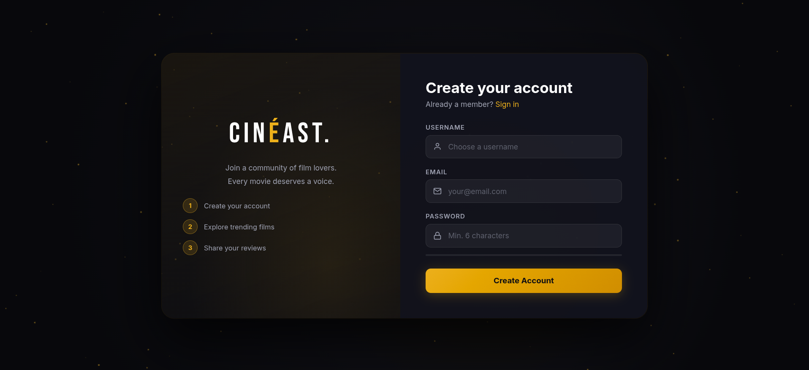

#### Login
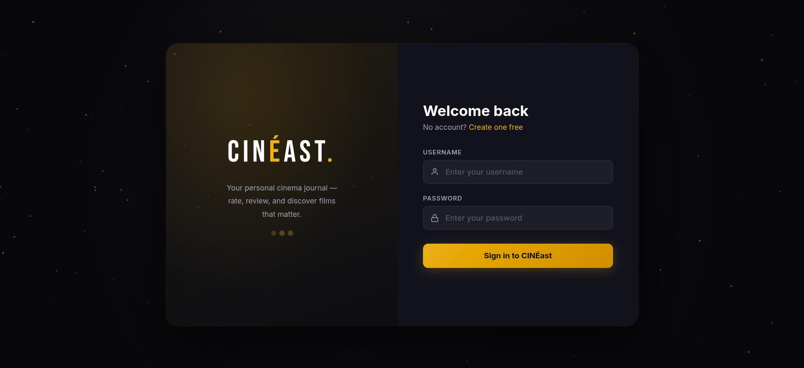

---

### 🍿 Discovery & Home
#### Homepage — Hero Section
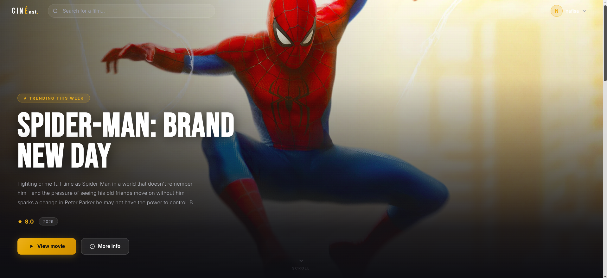

#### Homepage — Trending & Categories
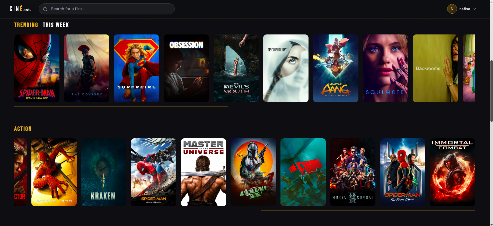

#### Homepage — Additional Collections
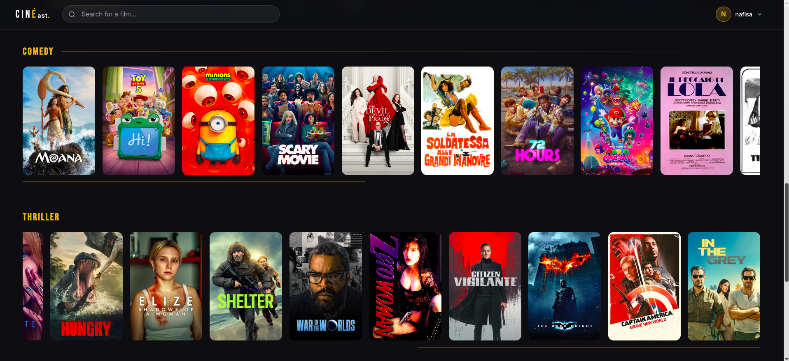

#### Footer
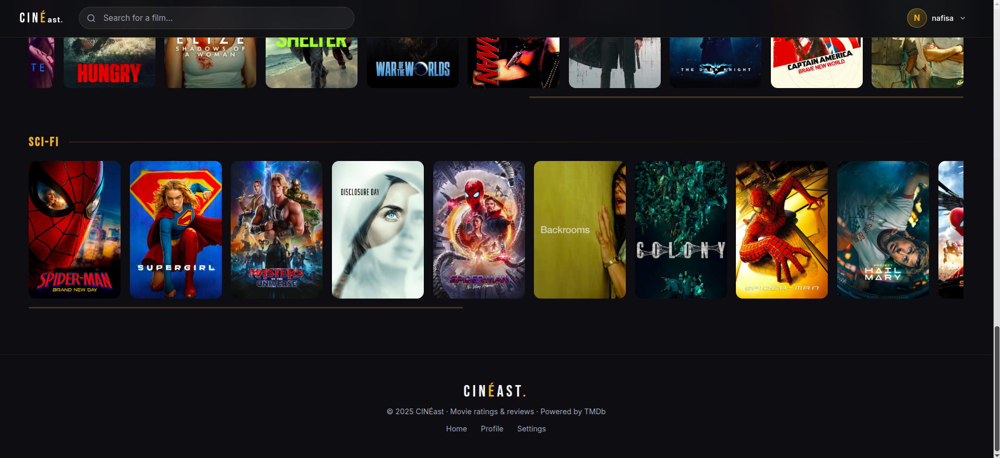

---

### 🎬 Movie Details & User Profile
#### Movie Details Page
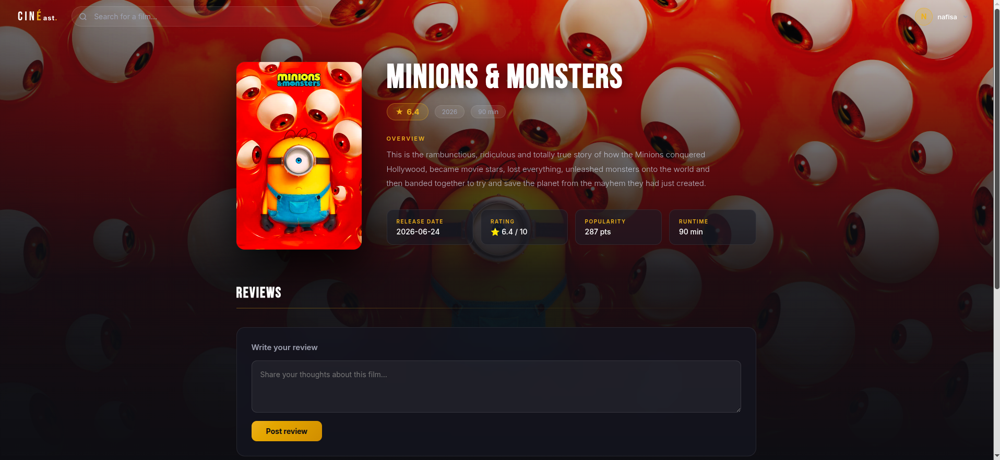

#### Profile Dropdown
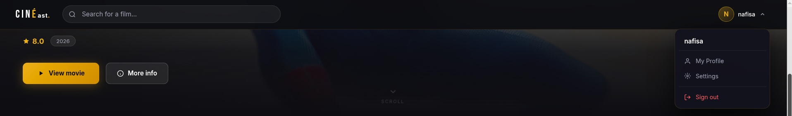

#### User Profile Page
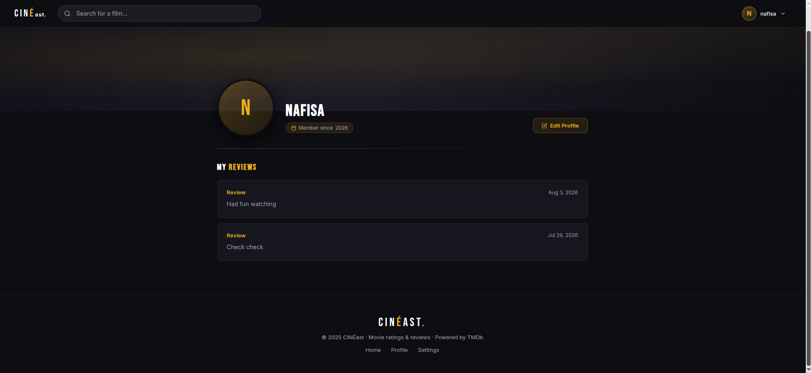

---

### ⚙️ Settings
#### Profile Settings
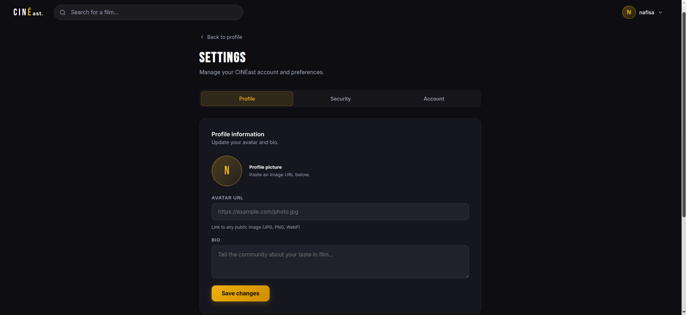

#### Security Settings
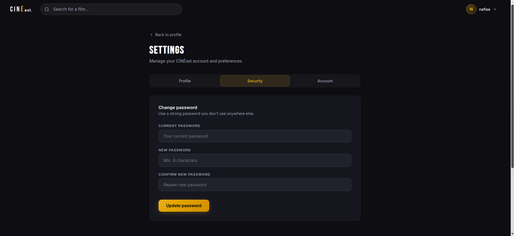

#### Account Settings
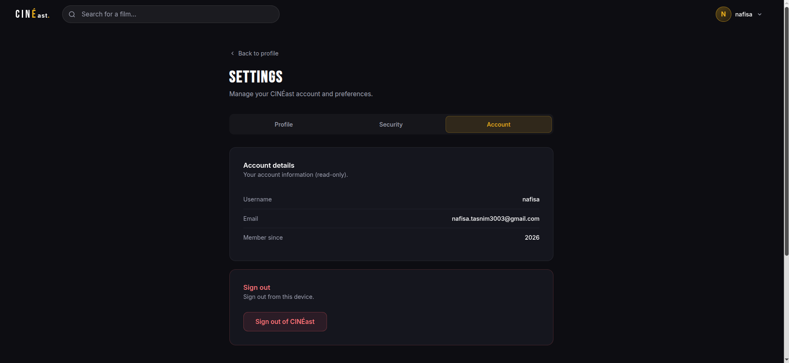

---

## Features

- Role-based authentication and authorization via Spring Security (JWT)
- Automated data persistence with Spring Data JPA — schema managed via Hibernate, no manual SQL
- Dynamic server-side view rendering with Thymeleaf
- Movie browsing, search, and detail pages
- Ratings and reviews per movie
- User profile with avatar and bio
- Settings with Profile, Security, and Account tabs
- Dark glassmorphism UI: `#0D0E12` background with `#E5A93C` gold accents, frosted-glass surfaces

## Tech Stack

- **Backend:** Java, Spring Boot 3.2.5, Spring Security (JWT), Spring Data JPA
- **Frontend:** Thymeleaf, HTML/CSS, vanilla JS
- **Testing:** JUnit 5 (32 tests)
- **Build tool:** Maven

## Design Patterns

CINÉast's backend implements four classic design patterns:

| Pattern | Purpose |
|---|---|
| Strategy | Runtime movie sorting (title / rating / date) |
| Adapter | Converts TMDb API JSON into internal `Movie` objects |
| Facade | Unified entry point for movie-related operations |

## Project Structure

```
CINEast/
├── src/
│   └── main/
│       ├── java/com/cineast/
│       │   ├── config/        # Spring Security & app config
│       │   ├── controller/    # Auth, Movie, Profile controllers
│       │   ├── model/         # JPA entities (Movie, User, Review)
│       │   ├── patterns/      # Singleton, Strategy, Adapter, Facade
│       │   ├── service/       # Business logic
│       │   └── CineastApplication.java
│       └── resources/
│           ├── templates/     # Thymeleaf HTML views
│           ├── static/        # CSS, JS, images used by the app
│           └── application.properties
├── docs/
│   └── screenshots/           # README screenshots (not part of the build)
├── pom.xml
└── README.md
```

## Getting Started

### Prerequisites

- Java 17+
- Maven 3.8+
- A running database (MySQL)

### Setup

```bash
git clone https://github.com/nafisa3003/CINEast.git
cd CINEast/cineast_v4
```

Configure your database connection in `src/main/resources/application.properties`, then run:

```bash
mvn spring-boot:run
```

The app will be available at `http://localhost:8083`.

### Running Tests

```bash
mvn test
```

## Roadmap

- **v5:** Migration to Supabase — Postgres via Transaction Pooler, Supabase Auth, Storage for avatars, Row Level Security, Realtime on reviews, and a public REST API via PostgREST

## Authors

- NAFISA
- NAWFAT

---

*CINÉast — a coursework project turned portfolio piece.*
